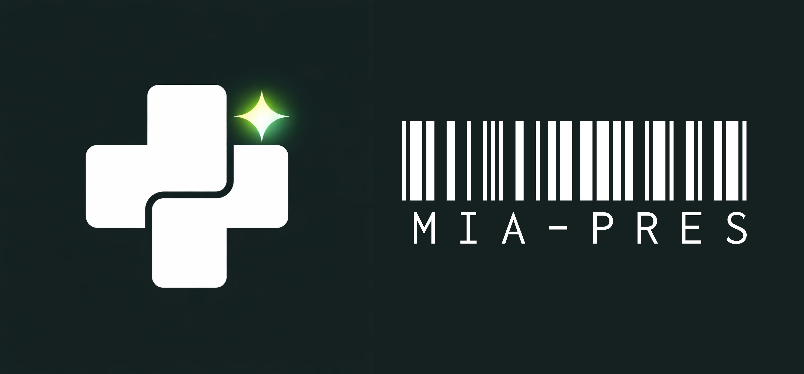

## Medical Intelligence Assistant for Prescription Interpretation and Medication Adherence Support System

## Project Introduction
MIA-PRES is an AI-powered medication management application 
that helps patients of all ages understand their prescriptions, 
build consistent medication habits, and never miss a dose — 
from the moment they receive their medication to every dose at home.

## Concept
MIA-PRES is a mobile application designed to solve one of the 
most persistent problems in modern healthcare — medication 
non-adherence. According to the World Health Organization, 
nearly 50% of patients worldwide fail to take their medications 
as prescribed. This issue is especially critical for patients 
managing chronic conditions such as hypertension, diabetes, 
and high cholesterol, where missing even a single dose can 
lead to serious health consequences.

The inspiration behind MIA-PRES comes from a real experience — 
watching a family member struggle to manage multiple daily 
medications for blood pressure and diabetes, unsure of the 
correct dosage, timing, and what to do when symptoms arise. 
This personal connection drives the core mission of MIA-PRES: 
to make medications understandable, schedules automatic, 
and adherence trackable — for every patient, every age, 
every routine.

A key innovation introduced by MIA-PRES is the QR Code 
Medication System — a concept not yet widely adopted in 
Thai hospitals. Each medication bag features a small QR code 
that, when scanned through the app, instantly retrieves 
complete medication data from a structured API. This eliminates 
manual input errors and ensures patients always receive 
accurate, reliable information directly from their prescription.

## System Core Features and Concepts
| Core Feature | Description |
|---|---|
| **Smart Prescription Scanner** | Uses Gemini API Image Understanding to analyze photos of prescriptions or medication labels and instantly presents drug names, dosage, instructions, warnings, and side effects in plain, everyday language. Supports both AI image scanning and QR Code scanning for precise medication data retrieval. |
| **QR Code Medication System** | A novel approach where each medication bag carries a QR code linked to a structured medication API. Scanning the QR code retrieves complete and accurate drug information instantly, reducing errors from manual input or AI misreading. |
| **Intelligent Medication Reminders** | Automatically generates a personalized medication schedule from the prescription scan and delivers smart reminders tailored to the user's routine. Supports multiple daily doses, custom timing, and chronic condition schedules marked as ongoing. |
| **AI Medication Assistant** | A context-aware chat assistant powered by Gemini API that answers medication-related questions based on the user's actual prescription history, including drug interactions, missed dose guidance, and side effect queries — with clear medical disclaimers. |
| **Real-Time Caregiver Monitoring** | Family members and caregivers can remotely track medication adherence through a live dashboard and receive instant alerts when a dose is missed. Supports real-time communication via voice call, video call, and in-app messaging powered by Agora SDK. |
| **Auto Dispenser Ready** | Designed to seamlessly connect with automated pill dispenser hardware via MQTT protocol, enabling the dispenser to automatically release the correct medication at the scheduled time based on the patient's active prescription. |

## 👥 Team Members
| - | Name | Reponsibility |
|------|------|---------------|
| 💻 | Chinnachart Waisoka | Team Leader, Project Manager and Full Stack Software Dev |
| 👀 | Patteera laolam | Research, Documentation and Presentation |
